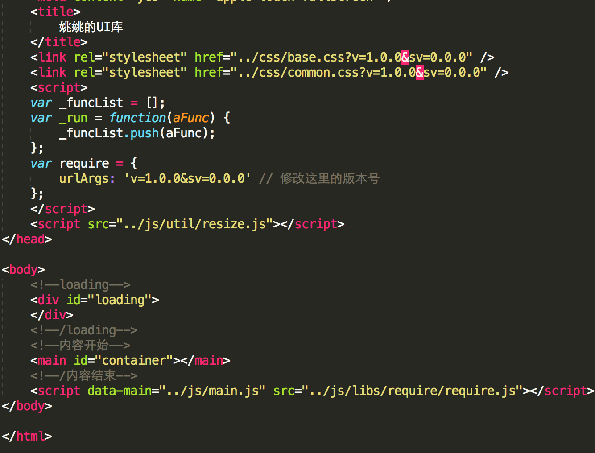
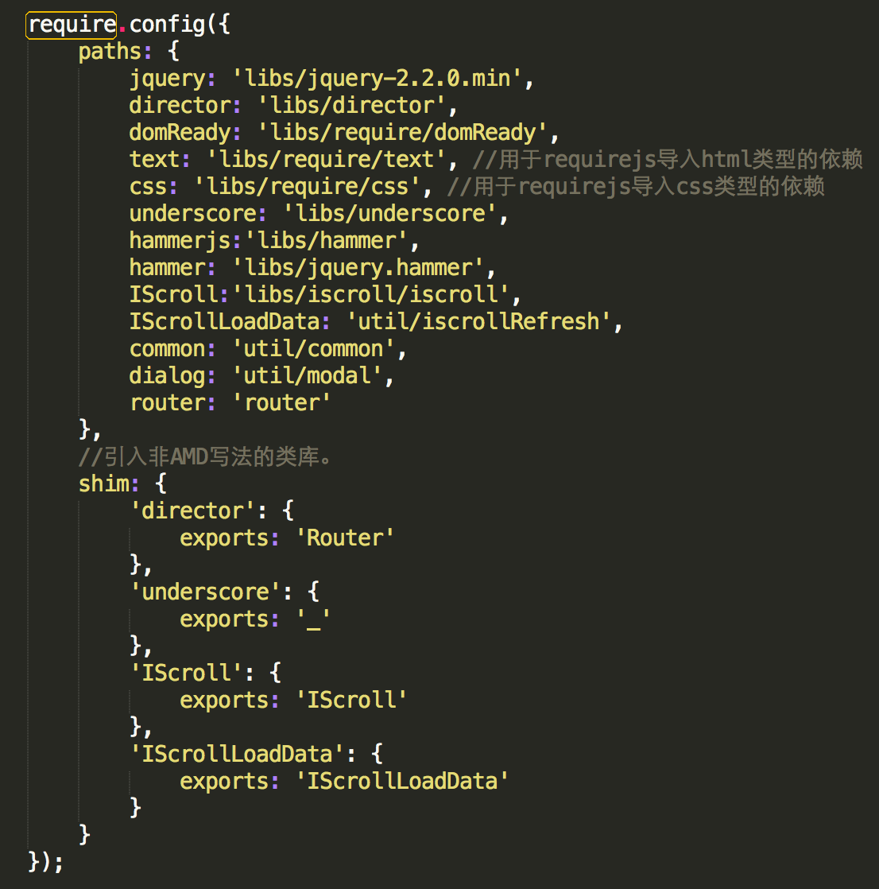
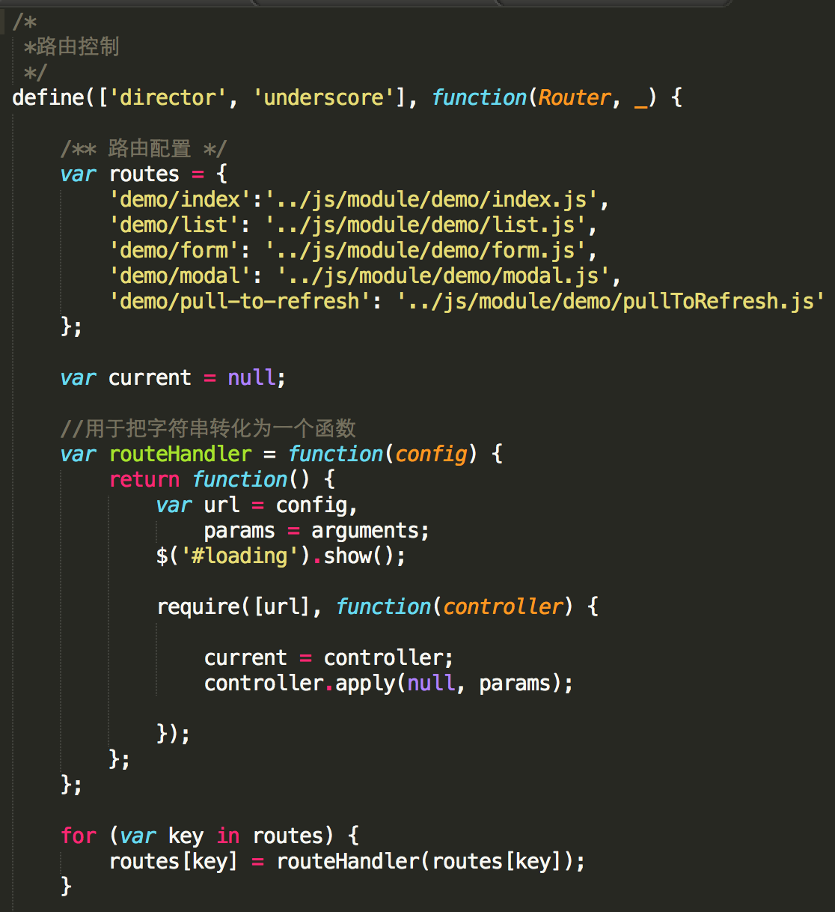
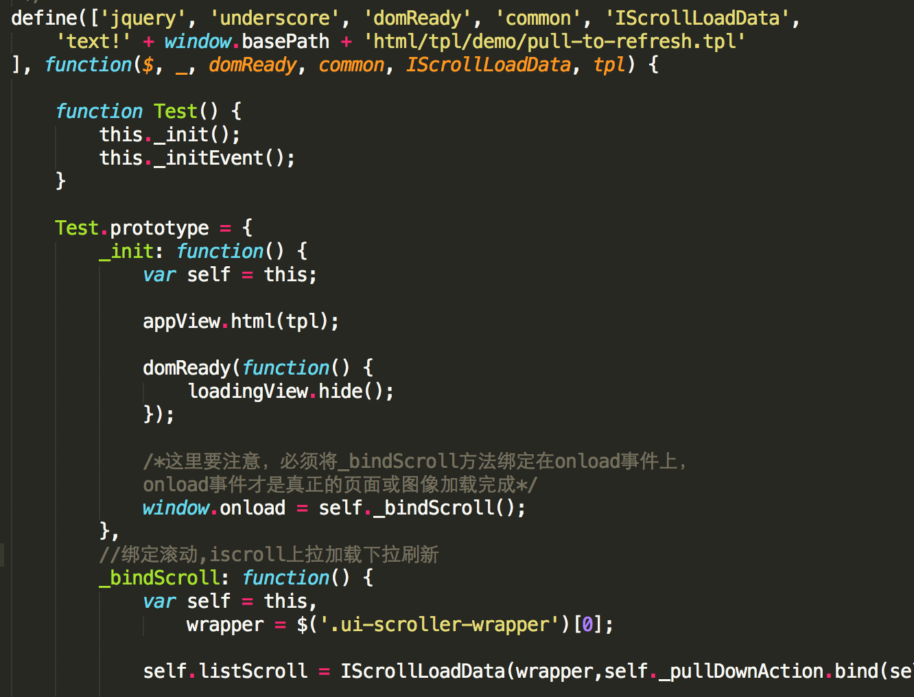

#  姚姚的UI库指南

##  架构

1.	director.js 路由
2.	require.js	 模块载入框架(text、domready、css)
3.	underscore.js js工具库
4.	jquery2.2.js
5.	hammer.js tap事件

##  思路

1.	启动程序
2.	监听路由
3.	路由变化，映射到对应的处理逻辑，加载对应的模块
4.	模块加载完成，修改dom
5.	页面跳转时，移除上一个模块，加载下一个模块，回到3

##  步骤
1.	index.htm
	requirejs引入main.js
	
2.	main.js配置requirejs的依赖，并启动webapp
	
3.	router.js配置路由
	
4.	各个模块
	index.tpl
	
	index.js
	

##	使用
	修改main.js中的window.basePath，改为当前项目地址
	如果用chrome打开，需要设置chrome支持ajax跨域请求数据
	链接地址比如首页链接：当前项目地址#demo/index

##	参考
[HTML5单页面架构](http://www.07net01.com/2015/07/872662.html)

[frozenui](http://frozenui.github.io/frozenui/demo/index.html)

	HTML5单页面架构参考了(自定义路由 + requirejs + zepto + underscore)的架构，在这个基础上，将zepto改为jquery，引入hammer库
	
	这个项目在样式上参考了frozenui库，在这个库的基础上，做了一些自己的改动。
	比如说表单的右侧按钮，作为可点击的按钮，这个区域必须比实际视觉效果更大，才能使用户点击时有更好的体验。
